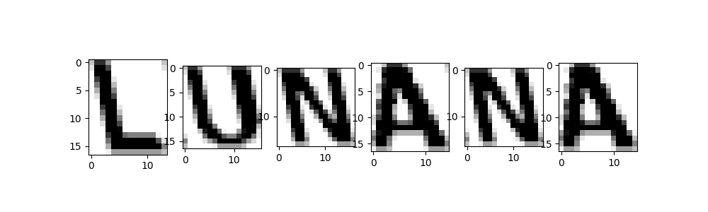
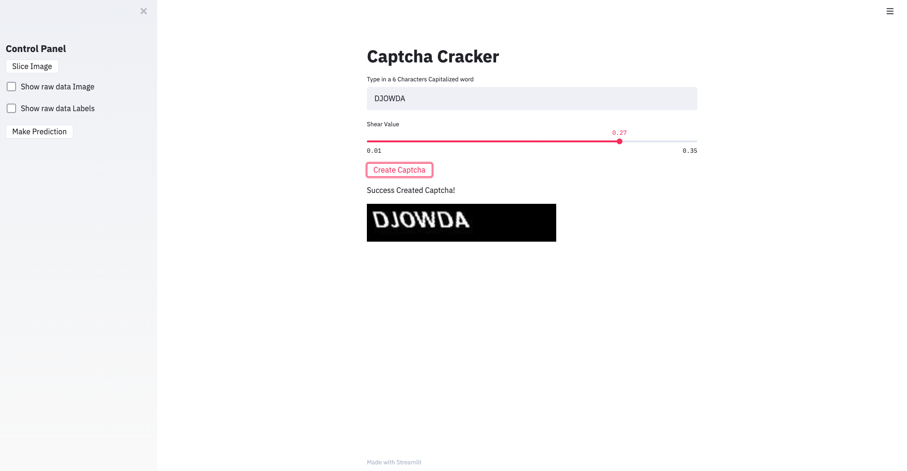

# Crack Captcha use DNN

### Intro
This app is to decipher a captcha.
User can type in a 6 character English word. Then a captcha will be displayed. User also can change the shear value.
Then user can view the process of (1) splitting the captcha; (2) the MLP predicting process; 
(3) the predicted result.
You can watch the demo.
###### E.g. Captcha After slicing 

### Set up
```console
foo@bar:~$ pip install Pillow==2.2.2
```
```console
foo@bar:~$ pip install scikit-image
```
```console
foo@bar:~$ pip install flask
```
```console
foo@bar:~$ pip install streamlit 
```
```console
foo@bar:~$ pip install scikit-learn
```
```console
foo@bar:~$ pip install pandas
```
```console
foo@bar:~$ !wget -nc http://labfile.oss.aliyuncs.com/courses/1133/Coval-Black.ttf
```

### Mechanism 
We use Multilayer Perceptron to train the model.
Parameters:
- hidden_layer_sizes: the #no. of hidden neurons
- random_state: random seed. can be set for repetitive training
- activation function: default: ReLu()

### Demo
streamlit run app.py
[](https://youtu.be/KOvr5T7Y2W8)